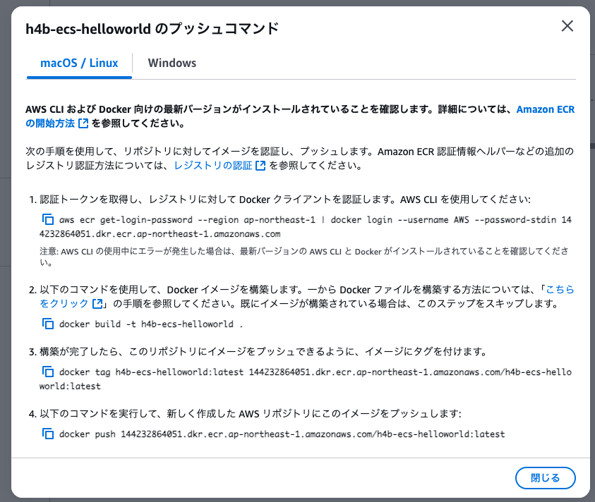

# AWS Hands-on for Beginners Amazon Elastic Container Service 入門　コンテナイメージを作って動かしてみよう

[AWS Hands-on for Beginners Amazon Elastic Container Service 入門 コンテナイメージを作って動かしてみよう | AWS Webinar](https://pages.awscloud.com/JAPAN-event-OE-Hands-on-for-Beginners-ECS-2022-reg-event.html)

## 3. コンテナイメージを作成して動かす

- Dockerfileはハンズオン通り
- コマンドもそのまま

```bash
# ビルド
$ docker build -t hello-world .

# 確認
$ docker images
REPOSITORY                     TAG                            IMAGE ID       CREATED          SIZE
hello-world                    latest                         0c5ab9a60daf   22 seconds ago   185MB

# コンテナを動かす
$ docker run -d -p 8080:80 --name h4b-local-run hello-world
ce69b8d060b879398691e96c0b9debb5749bd715aef71a2fc26eba7e65e409f1

# 増えてる
$ docker ps
CONTAINER ID   IMAGE                                      COMMAND                   CREATED          STATUS                  PORTS                                                                NAMES
ce69b8d060b8   hello-world                                "/bin/sh -c /root/ru…"   18 seconds ago   Up 16 seconds           0.0.0.0:8080->80/tcp, [::]:8080->80/tcp                              h4b-local-run
3

# コンテナにアクセス
$ curl http://localhost:8080
Hello World!

# コンテナの中に入る
$ docker exec -i -t h4b-local-run bash

# （コンテナ内にDockerfileで指定した内容が反映されているかの確認）

# コンテナから抜ける
$ exit
```

### これをTerraformで管理する

- import.tf を作る
  - to は `aws_ecr_repository.service` 固定
  - id はリポジトリ名
  - ref. https://registry.terraform.io/providers/hashicorp/aws/latest/docs/resources/ecr_repository#import

```terraform
import {
  to = aws_ecr_repository.service
  id = "h4b-ecs-helloworld"
}
```

- 以下の順にコマンド実行

```bash
$ terraform init
$ terraform plan -generate-config-out=generated.tf
$ terraform apply
```

- [任意] `generated.tf` の内容は `main.tf` に移して、ファイルごと削除

## 4. コンテナイメージを、ECR にアップロードする

- ECRは画面からリポジトリ作成
    - リポジトリ名は指示通り `h4b-ecs-helloworld`
- URIをコピー
- 手元でdocker build

```bash
$ docker build -t <リポジトリURI>/h4b-ecs-helloworld:0.0.1 .
```

- docker pushするためにAWS CLIで認証通しておく

```bash

$ aws --profile=private ecr get-login-password --region ap-northeast-1 | docker login --username AWS --password-stdin 144232864051.dkr.ecr.ap-northeast-1.amazonaws.com
```

- プッシュ

```bash
$ docker push 144232864051.dkr.ecr.ap-northeast-1.amazonaws.com/h4b-ecs-helloworld:0.0.1
```

AWSの管理画面でも丁寧なガイドが出るので、基本これに沿って進めればOK



疑問

✅docker tag 使わないでいけたけど、何が違う？

→docker tagは既存イメージにエイリアスつけるイメージ

### 作成したリポジトリをTerraform管理する

### リポジトリにpushしたイメージは？Terraformで管理するものある？

## 5. コンテナオーケストレーションの ECS を作成する

## 6. コンテナの自動復旧、スケールアウトをやってみる
